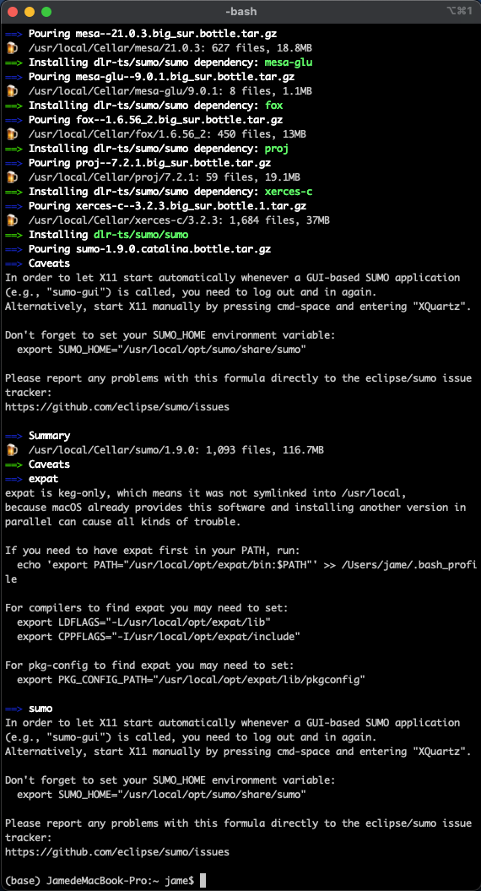

# SUMO Note

Author: Jian Yuan

Environment: MacOS BigSur Version 11.1

# 1 SUMO Installation (MacOS)

SUMO提供多种版本系统的安装渠道，本文仅介绍MacOS系统的安装。目前，在MacOS上支持两种安装方式，第一种是安装[已经发布的版本(Homebrew-based installation guide)](https://sumo.dlr.de/docs/Installing/index.html#macos)，第二种是[通过Source Code进行安装](https://sumo.dlr.de/docs/Installing/MacOS_Build.html)，第二种方式除了可以体验到最新版本外，还可以自行对SUMO的相关功能进行延伸拓展。

这里先介绍第一种方式，即`Homebrew-based installation`。之所以这里需要再补充下，是因为实际操作下来，发现说明文档并没有覆盖到一些细节问题。

## 1.1 **步骤1**：安装Homebrew

SUMO Documentation显示如下：

```bash
/bin/bash -c "$(curl -fsSL https://raw.githubusercontent.com/Homebrew/install/master/install.sh)"
```

但国内网络安装并不一定顺畅，建议使用如下网页渠道进行下载（按其提示即可）：

> https://brew.idayer.com/


## 1.2 **步骤2**：安装SUMO

安装完后，按照SUMO Documentation一路执行（没遇到问题）：

```bash
brew update
brew install --cask xquartz
brew tap dlr-ts/sumo
brew install sumo
```

最后得到图片如下：



在这个图中有两个需要注意的问题：

> (1) In order to let X11 start automatically whenever a GUI-based SUMO application (e.g., "sumo-gui") is called, you need to log out and in again. 

- Xquartz X11是Mac用来显示SUMO软件界面的工具，可以看做是一个虚拟机

- 这里的log in / log out，在Github上询问了才知道，是指在MacOS系统登出下你的Apple ID

> (2) Don't forget to set your SUMO_HOME environment variable: 
>
> export SUMO_HOME="/usr/local/opt/sumo/share/sumo”

- 这个路径信息要记下来，后面要用。其本质就是设置了一个路径的快捷键：用`$ SUMO_HOME`替换上面那一大串

## 1.3 **步骤3**：设置环境变量

**（1）设置环境变量**

环境变量，粗浅的理解，即能够用一个字符串代表一个路径并快速调用。这一步比较关键，需要对命令行操作有一些基本的知识。

> SUMO Documentation: 
>
> To finalize your setup, please make sure to set the **SUMO_HOME** environment variable and have it point to the directory of your SUMO installation. Depending on your shell, you may set this variable either in `.bashrc` or `.zshrc`. To set this variable in `.bashrc` you can use the following commands.
>
> ```bash
> touch ~/.bashrc; open ~/.bashrc
> ```

首先，mac的command line有两种格式：`bash`和`zsh`。你需要知道的就是目前自己属于哪一种，在命令行中输入`XXX`即可知道你的电脑使用的是哪一种。另外，输入`chsh -s /bin/zsh`可以进行command line版本切换，这一切要在一开始完成。

接下来，注意第一个命令`touch ~/.bashrc`会生成一个新的`.bashrc`文件，若你之前有存储过环境变量，这个命令会导致这部分路径丢失。因此，建议先使用第二个命令`open ~/.bashrc`打开看看，不行再两步都执行。

在打开的`.bashrc`中输入如下命令（其中第一行就是上面安装sumo时弹出来的路径，第二行指向的是基于Python的现有工具库）：

```bash
export SUMO_HOME="/usr/local/opt/sumo/share/sumo"
export PYTHONPATH="/usr/local/opt/sumo/share/sumo/tools"
```

**（2）刷新环境变量**

最后，关闭文档，在命令行中输入如下命令进行刷新，即可添加环境变量：

```bash
source ~/.bashrc
```

注：

- 检测：输入`echo $SUMO_HOME`，若能够弹出对应的路径，说明环境变量添加成功
- 本人的Mac上每次重启命令行都会出现环境变量丢失的情况，因此每次都需要使用上述命令行，将`SUMO_HOME`重新加入到环境中


## 1.4 步骤4：安装GUI/Icons

安装sumo-gui：

```bash
# 官网给的这个会报错
brew cask install sumo-gui

# 知乎给的这个命令行亲测有效
brew install —cask sumo-gui
```

点击如下链接，可安装sumo-gui和netedit的icons

> https://sumo.dlr.de/daily/SUMO_launchers.dmg


最后，给出官方沟通渠道：

> Please report any problems with this formula directly to the eclipse/sumo issue tracker:
>
> https://github.com/eclipse/sumo/issues

本人在联系时产生的Issue：

> https://github.com/eclipse/sumo/issues/8532

